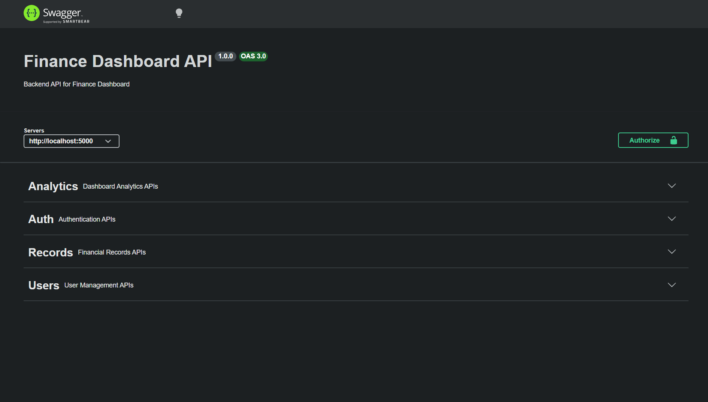
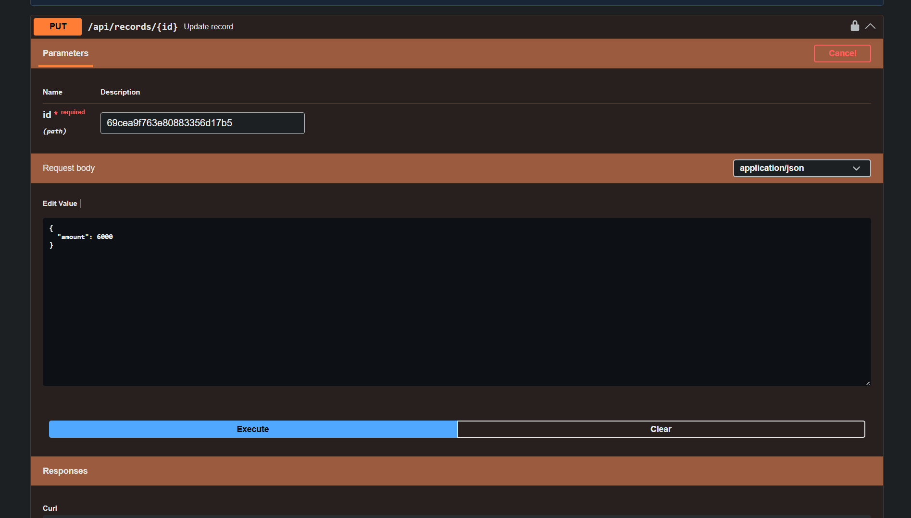
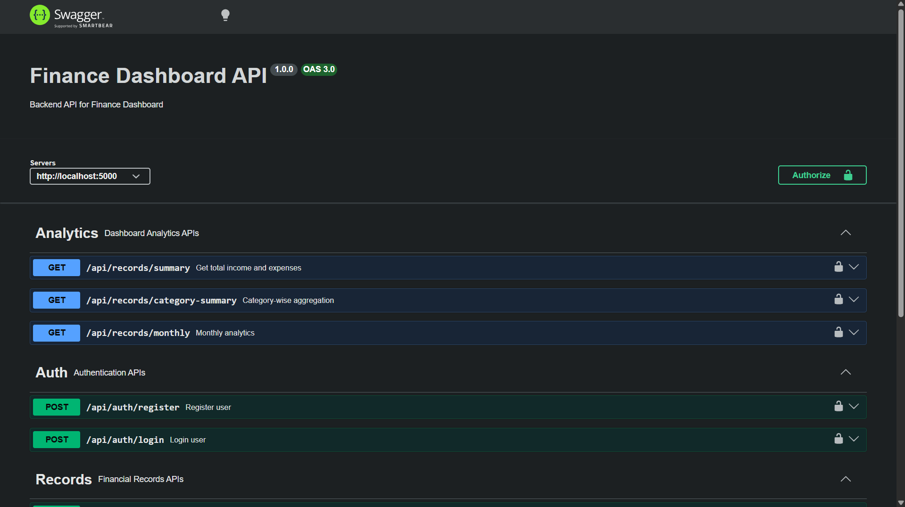
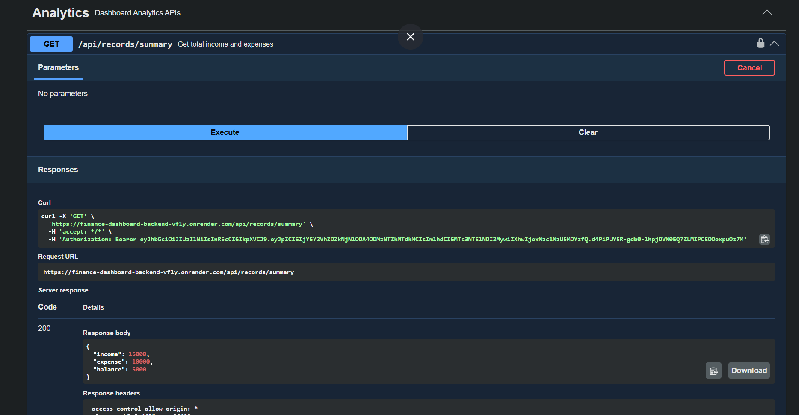
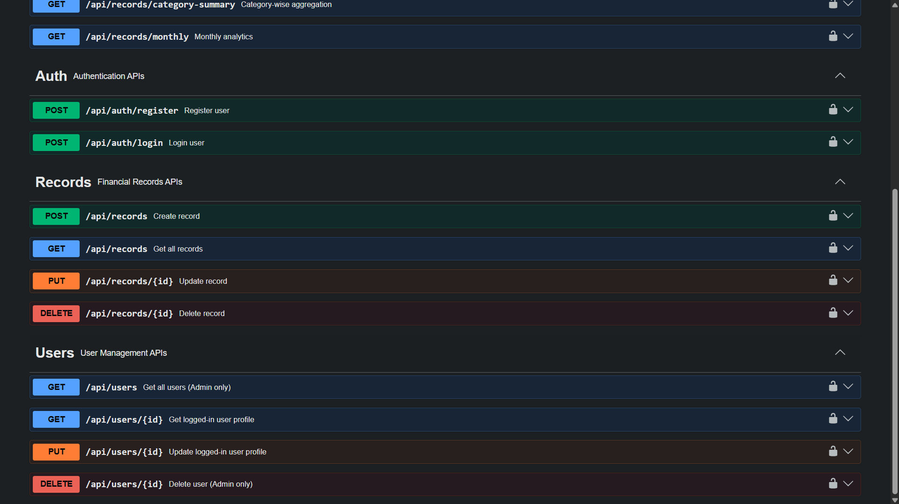
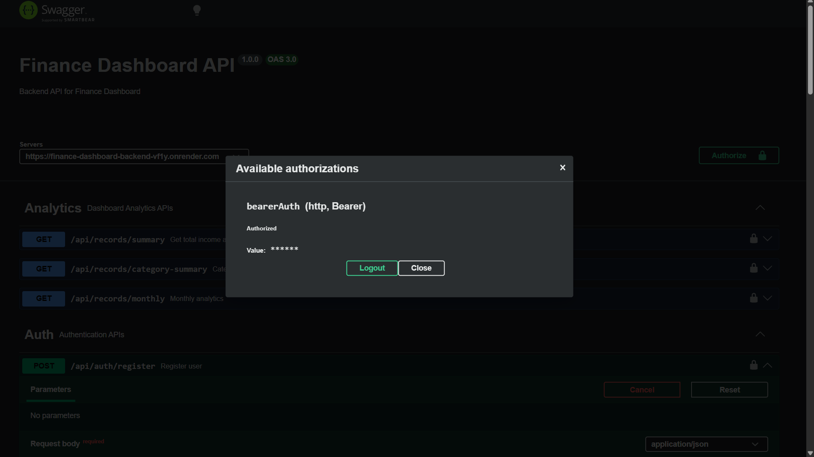
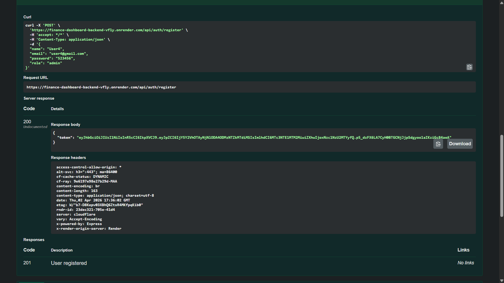

# Finance Dashboard Backend API

A scalable backend system built for managing financial records, user roles, and analytics. Designed with clean architecture, role-based access control, and real-world backend practices.

---

## Features

###  Authentication & Authorization
- JWT-based authentication
- Role-Based Access Control (RBAC)
  - Viewer: Read-only access
  - Analyst: Access analytics
  - Admin: Full control

---

### Financial Records
- Create, update, delete transactions
- Fields: amount, type, category, date, note
- Filtering by category and type
- Pagination support

---

###  Dashboard Analytics
- Total income & expenses
- Net balance
- Category-wise aggregation
- Monthly analytics

---

###  Backend Quality
- Input validation middleware
- Centralized error handling
- Clean MVC architecture

---

## Tech Stack

- Node.js
- Express.js
- MongoDB (Mongoose)
- JWT Authentication

---

## API Endpoints

### Auth
- POST `/api/auth/register`
- POST `/api/auth/login`

### Records
- GET `/api/records`
- POST `/api/records`
- PUT `/api/records/:id`
- DELETE `/api/records/:id`

### Analytics
- GET `/api/records/summary`
- GET `/api/records/category-summary`
- GET `/api/records/monthly`

---

## Setup Instructions

```bash
git clone https://github.com/Jaynikhar/finance-dashboard-backend.git
cd finance-dashboard-backend
npm install


# ## Screenshots

# ### Swagger API Docs
# 

# ### Records API Response
# 
# 

# ### Analytics Dashboard
# 
# 


# ###  Authorization
# 
# 
# 


## Screenshots

### Swagger API Docs
screenshots/swagger.png

### Records API Response
screenshots/records-response.png


### Analytics Dashboard
screenshots/analytics-api.png


###  Authorization
/screenshots/auth-records-user-api.png
/screenshots/authorization.png
/screenshots/user-registered.png
./screenshots/user-login.png


### User
./screenshots/show-all-users.png
./screenshots/user-login.png


### User
./screenshots/show-all-users.png